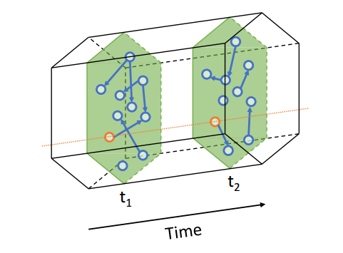
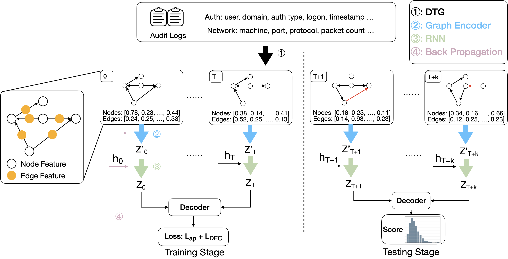

## Understanding and Bridging the Gap Between Unsupervised Network Representation Learning and Security Analytics

## Main Idea

我们重新审视了之前基于无监督网络表征学习（UNRL）的图安全分析，并认为应以攻击无关的方式考虑通用攻击特征，而不是标准的 UNRL 模型。我们设计的 Argus 采用了新的编码器和解码器，考虑了离散时间图 (DTG)，以利用图的时间动态。我们在 LANL 和 OpTC 数据集上对 Argus 进行了评估，结果表明其性能优于 SOTA。

## Background

### UNRL

UNRL（Unsupervised Network Representation Learning）是一种无监督学习方法，用于生成图网络中节点的latent representations ，即node embeddings。latent representations 旨在捕获关键结构特征，并可作为各种机器学习模型(如神经网络)的输入。在相同的latent representations 上可以执行不同的下游任务，包括节点分类、链接预测、聚类、图重构等，以链接预测为例，它预测两个节点是否有可能存在链接 (例如，Facebook上的两个用户实际上是否相互认识)。UNRL已被应用于许多图形安全分析（Graph Security Analytics）领域，以帮助检测网络中的异常行为和安全威胁。

### DTG

Discrete Temporal Graph

在静态图G = (V, E)的定义下，定义了在时隙t观测到的DTG快照（snapshot），其中Gt = (Vt, Et)。因此，在t = 1,2，…τ观察到的时序图序列表示为G1, G2，…， Gτ。当u, v∈Vt时，在快照t中它们之间发生了一些相互作用时，Et中会存在一条边e = (u, v)，

## Issues of the previous papers

Issue-A: Gap between link prediction and attack detection

将攻击检测简单等同于链接预测存在问题,因为负边(不存在的边)与恶意边在分布和模式上存在本质差异。对于普通链接预测问题,负边通常是随机生成的,但恶意边往往遵循攻击者特有的模式。

Issue-B: Missing edge features.

之前的无监督网络表示学习方法没有充分利用日志数据中丰富的边特征信息,例如认证事件的用户ID、网络流量的数据包大小等。它们只使用了节点特征和边权重,而忽视了这些有价值的边属性信息。

Issue-C: Static graph modeling over long period.

现有的无监督网络表示学习方法通常在静态图上进行训练和测试,无法捕捉图结构随时间的动态演化。然而,在安全分析场景下,攻击行为通常是一个跨越多个时间点的渐进过程,其图结构模式会随时间发生变化。

## Framework

### 解读

#### Step1 

$$
G_0, G_1, . . . , G_T = Separate(G,T)
$$

#### Step2 

$$
X_t, A_t, F_t = data\_split(G_t)
$$

$$
Z_t^{\prime}=ENC(X_t,A_t,F_t)
$$

$X^t$ : Node Feature

$A^t$ : t 时刻的邻接矩阵

$F_t$ : Edge Feature

#### Step3

$$
[Z_0,Z_1,..,Z_T]=RNN([Z_0^{\prime},Z_1^{\prime},..,Z_T^{\prime}])
$$

#### Step4

$$
\hat A_t=p(A_t|Z_t)=DEC(Z_t)
$$

$\hat A_t$ ：重构的邻接矩阵

#### Step5

$$
loss=L_{ap}+\beta*L_{DEC}
$$

$$
L_{DEC}=-log(p(A_t|\hat A_t))
$$

## Evaluation

### Datasets

- LANL

  LANL是指洛斯阿拉莫斯国家实验室（Los Alamos National Laboratory），是美国能源部下属的一个研究机构。LANL的2015年综合多源网络安全事件数据集是一个包含来自LANL内部计算机网络活动记录的数据集，包括个人计算机事件、DNS域控制器服务器的交互、进程启动和停止记录、DNS服务器上的登录尝试以及路由器上的网络流量。该数据集还包括对被认为受到侵害的计算机进行的模拟网络攻击的认证事件。

- OpTC

  OpTC是DARPA透明计算（TC）计划中的一个数据集，记录了在814个主机上发生的各种主体（如进程）和对象（如文件和套接字）之间的活动,包括系统调用、文件活动、套接字事件、网络流量等

  

### Evaluation metrics

$$
Precision =\frac{TP}{TP+FP}
$$

$$
Recall=\frac{TP}{TP+FN}
$$

$$
FPR=\frac{FP}{TP+FP}
$$

TP：define the edges containing at least one malicious event as TP

TN：define the edges containing all normal events as TN

FP and  FN are defined as the edges misclassified as malicious and normal respectively.
$$
AP=\sum_{n}^{} (R_n-R_{n-1})\times P_n
$$
 $R_n$ and $P_n$ are the Precision and Recall at the n-th threshold. 

### Evaluation Result

